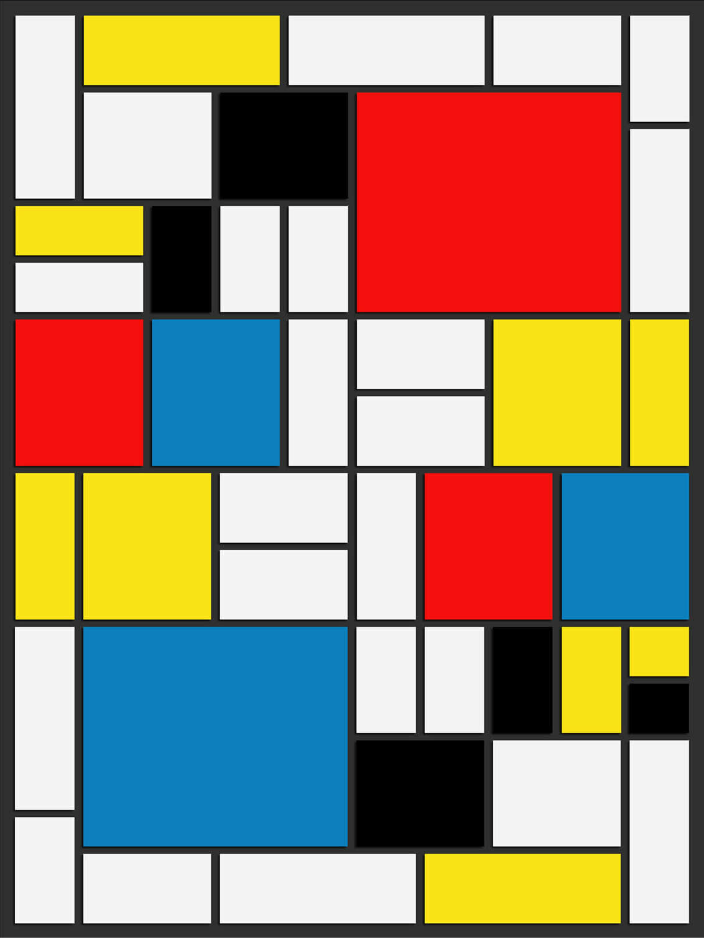

# Mondrian Copy

⚡️[Live Site](https://intuitiveharmony.github.io/mondrianCopy/)

I wanted to practice my CSS skills by replicating a piece by Dutch painter Piet Mondrian.

*Image I used for reference*

